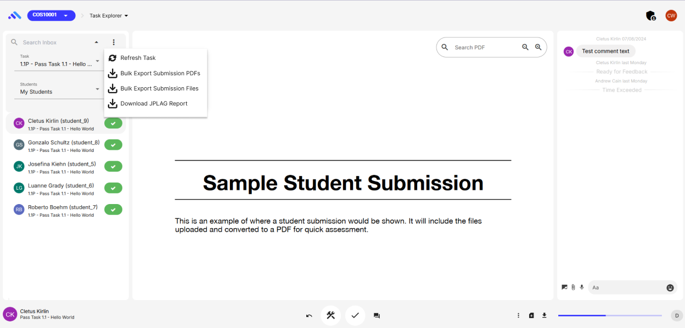

### Author Information

---

- Author(s): Jack Carroll
- Team: JPLAG Implementation
- Team (Delivery and/or Product) Lead: Jack Carroll and Andrew Cain

### Key Links/Resources

---

- [JPLAG Git Repo](https://github.com/jplag/JPlag)
- [Eclipse Temurin JDK Image](https://hub.docker.com/_/eclipse-temurin)

## Document Summary

---

- JPLAG feasability document
- Document Type: Informative
- Documentation Information Summary:

  This document serves to outline the requirements of the JPLAG project and the approach that will
  be taken to achieve implementation.

  JPLAG is a plagiarism detection software that finds pairwise similarities among a set of
  multiplate program files. It supports a variety of languages, and can reliably detect software
  plagiarism and collusion in software development, even when obfuscated. All similarities are
  calculated locally, and doesn't upload anything to the internet.

## JPLAG Process

---

We plan to have JPLAG running in it's own container as a batch process. It will run the .jar file,
from the official git repo, and accessed with via CLI commands from upstream containers.

Adding another container to the docker_compose file in .dev_container will require an image that
supports Java SE 21, such as eclipse-temurin:21-alpine. It will also reference the .jar file to
create a volume in the container.

The current **unit_similarity_module.rb** file already defines how the batch process is managed. I
believe using this method will also be suitable for JPLAG. This file can be altered to use ruby shell commands to: start jplag container > run jplag jar file > remove jplag container.

The current MOSS batch process **unit_similarity_module.rb** is called from a rake file task.

## Backend

---

JPLAG lets you define a source code file as a template, so it won't report any plagiarised lines if
they already exist in that file. There will need to be a way for the task source code file (if
exists) to be sent to JPLAG when it's running on that task's submissions.

When JPLAG generates a report, it comes in a zip file with the following structure:

```
result.zip
│   overview.json
|   submissionFileIndex.json
|   options.json
│
└───submissions
│   └───submissionId1
│       │   submission1File1
│       │   submission1File2
│       │   ...
│   └───submissionId...
│       │   ...
│   └───submissionIdN
│       │   submissionNFile1
│       │   submissionNFile2
│       │   ...
│   submission1-submission2.json
│   submission1-submission3.json
│   submission1-submission....json
│   submission1-submissionN.json
│   ...
```

We still need to decide how we will manage the storage of these reports, because obviously we don't
want to take up space storing the code files twice.

We should be able to use the information defined in the comparison json files to populate the
existing **task similarities table**. The comparison jsons give an average and max similarity
percentage, which we will use the **max** to populate the **pct** field in the table.

## Frontend

---

If you login as a convenor, navigate to any unit > Inbox > Explorer > goto any of student submission, currently you will find a "View Similarities" button for the MOSS plagiarism detection report. We aim to extend this functionality to include JPlag. To achieve this, we plan to embed the JPlag report viewer into this section for seamless integration. The report generated by JPlag, available in a zip file format, will be processed and displayed in a readable format similar to the existing MOSS reports.

We have created a button labeled "Download JPLAG Report," which can be seen in the below UI; positioned next to the "View Similarities" button, allowing the teaching staff to download the detailed JPLAG analysis. This button will be accessible in the task explorer section (navigate to any unit > Inbox > Explorer) and will offer batch operations such as bulk export of submission files and PDFs. Once clicked, it will trigger the download of the generated JPLAG report zip file.



The below image shows a JPlag report and comparison list, which is what we are aiming to achieve as output after implementing JPlag. This report viewer will display key metrics, including total submissions, number of comparisons, and submission details.

- **Report Viewer:** 
  - The viewer will visualize a distribution of comparisons, as seen in the graph. 
  - It breaks down the percentage similarity ranges (0-10%, 11-20%, etc.).
  - This helps users identify how submissions are distributed in terms of similarity.

- **Comparison List:**
  - A sortable table of top comparisons will be displayed.
  - The table will show the submissions involved, their average and maximum similarity, and their respective cluster group.
  - This table makes it easy for instructors to quickly identify and investigate potential plagiarism cases.


We also want to have a UI for the data in the task similarities table too - so that you can see it
when you assess a students work and their portfolio.
